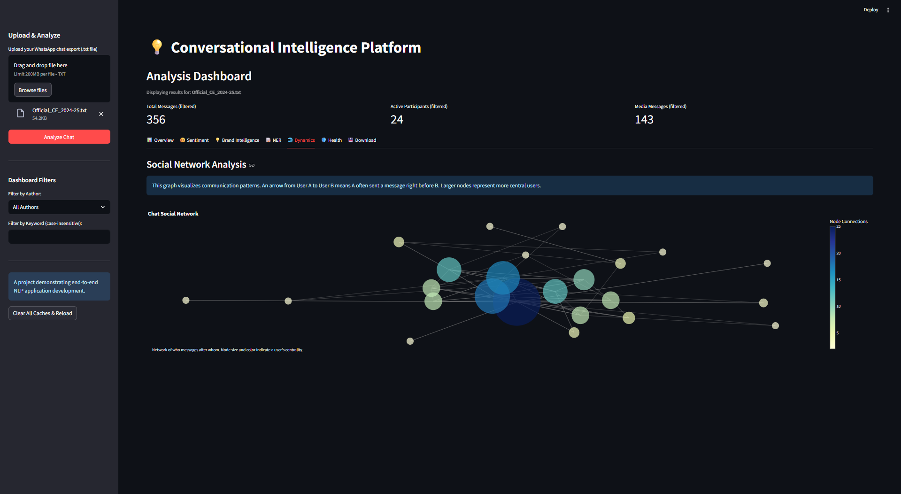

# Conversational Intelligence Platform

A full-stack data platform designed to unlock actionable insights from unstructured WhatsApp chat data. Move beyond simple message counts and discover the sentiment, topics, and social dynamics driving your conversations.

### ✨ [**View the Live Demo Here!**](https://YOUR-STREAMLIT-APP-URL.streamlit.app/) ✨

*(Replace the link above with your deployed Streamlit Cloud URL)*

---

*A preview of the main analysis dashboard.*

## What Problem Does This Solve?

Raw chat logs are a goldmine of information, but they are noisy and unstructured. It's impossible to manually sift through thousands of messages to understand key trends. This platform automates the entire process, providing answers to critical questions for any community or brand manager:

*   **What is the overall mood of our community?**
*   **Are there any toxic conversations that need our attention?**
*   **Who are our most positive and influential members?**
*   **How is our brand or product being discussed? What is the sentiment around key features?**

## Core Applications & Features

This platform is designed to serve two primary use cases: **Brand Intelligence** and **Community Health**.

#### 💡 Brand Intelligence
Track and analyze conversations around your brand, products, or any topic of interest.

*   **Topic-Centric Dashboard:** Enter keywords (e.g., "price", "battery", "new feature") to get a dedicated analysis for each.
*   **Sentiment Tracking:** Instantly gauge the positive vs. negative sentiment for any topic you're tracking.
*   **Intelligent Suggestions:** The platform uses Named Entity Recognition (NER) to automatically suggest relevant brands, products, and organizations to analyze from the chat data.

#### 🛡️ Community Health & Moderation
Build safer and more engaging online spaces by understanding group dynamics and identifying key individuals.

*   **Automated Toxicity Detection:** A dedicated dashboard flags potentially toxic messages for moderator review, sorted by severity.
*   **Community Champions Leaderboard:** Identify and reward your most positive and active members using a data-driven "Contribution Score".
*   **Social Network Analysis:** Visualize the communication patterns in your group to understand who the key influencers are and identify potential communication silos.

## How to Use

1.  **Export a chat** from WhatsApp as a `.txt` file.
2.  **Visit the live application** using the link above.
3.  **Upload the file** using the sidebar.
4.  **Click "Analyze Chat"** and explore the interactive dashboard!

---

*Built by [Vaishnav] (https://www.linkedin.com/in/vaishnav-mankar/)*